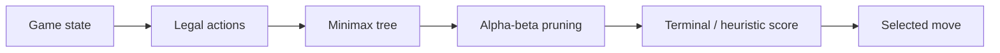

# Adversarial Game Ai

[](https://www.python.org/) [](#testing) [](LICENSE)

> Analyze adversarial game states with minimax, alpha-beta pruning, and heuristic evaluation.

## Why this project exists

A strategic agent must choose actions while anticipating an opposing player who is actively optimizing against it.

The implementation is intentionally small and reproducible so the underlying AI reasoning is easy to inspect, benchmark, and discuss.

## AI concepts demonstrated

Game trees, minimax, alpha-beta pruning, terminal evaluation, depth-limited search, adversarial decision-making

## Architecture



## Results

The demo evaluates a mid-game Tic-Tac-Toe position and selects move **8** with a minimax score of **9**. The implementation also exposes search depth and alpha-beta control for further benchmarking.

## Project structure

```text
adversarial-game-ai/
├── README.md
├── LICENSE
├── requirements.txt
├── examples/
│   └── demo.py
├── src/
│   └── implementation
└── tests/
    └── test_*.py
```

## Run locally

```bash
python -m venv .venv
# macOS/Linux
source .venv/bin/activate
# Windows PowerShell
# .venv\Scripts\Activate.ps1

pip install -r requirements.txt
PYTHONPATH=. python examples/demo.py
```

## Testing

```bash
PYTHONPATH=. pytest -q
```

## Ideas for extending the project

- Scale the environment or dataset and compare runtime and search behavior.
- Add richer visualizations or an interactive interface.
- Introduce additional baselines and ablation experiments.
- Add configuration files so experiments are reproducible from the command line.

## Portfolio note

This project is independently structured and documented as a portfolio implementation inspired by AI concepts studied in CS221. Do not publish course-provided starter code, solutions, tests, or restricted materials.

## GitHub metadata

**Repository name**

`adversarial-game-ai`

**Description**

`Analyze adversarial game states with minimax, alpha-beta pruning, and heuristic evaluation.`

**Topics**

`artificial-intelligence` `game-ai` `minimax` `alpha-beta-pruning` `adversarial-search` `python` `algorithms` `cs221`
